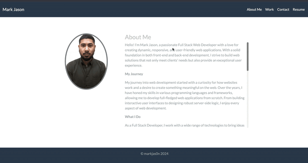
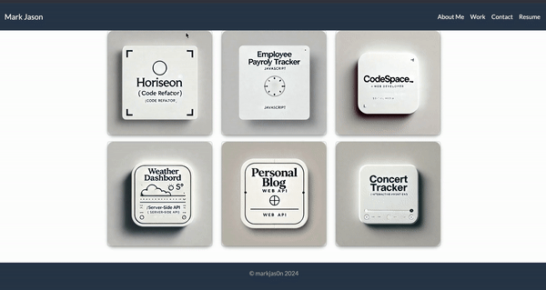
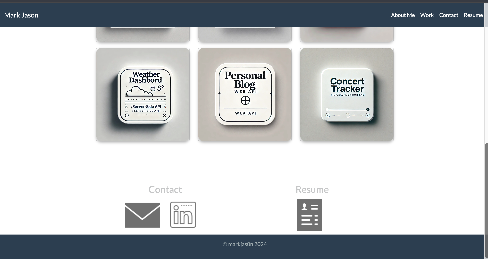

# Mark Jason's Portfolio

Welcome to Mark Jason's Full Stack Web Dev portfolio. This project showcases my skills, work, and experience as a web developer, featuring various projects I have worked on. The portfolio is designed to be clean, responsive, and user-friendly, highlighting both front-end and back-end capabilities.

## Table of Contents

- [Screenshots](#screenshots)
- [Features](#features)
- [Technologies Used](#technologies-used)
- [Installation](#installation)
- [Usage](#usage)
- [Contact](#contact)

## Screenshots
#### The images below demonstrates the application's function.
- 
- 
- 

Check out the live version of the portfolio: [Live Demo Link](#)

## Features

- **Responsive Design**: Optimized for mobile, tablet, and desktop views.
- **Scroll Effects**: Smooth scrolling with custom-styled scrollbars.
- **Hover Effects**: Subtle effects on project images and contact icons to enhance user interaction.
- **Floating Navbar**: A sticky navigation bar that stays at the top while scrolling.
- **Dynamic About Section**: The "About Me" section is scrollable, allowing more content to be displayed without overwhelming the user.
- **Interactive Contact and Resume Sections**: Clickable icons with hover effects and pop-up messages.

## Technologies Used

- **HTML5**: For the structure of the portfolio.
- **CSS3**: For styling, including custom scrollbars, hover effects, and responsive design.
- **Bootstrap**: For responsive layout and component styling.
- **JavaScript**: For handling pop-up messages on the contact icons.
- **Git**: For version control.
- **GitHub**: For repository hosting.

## Installation

To run this project locally, follow these steps:

1. **Clone the repository:**
    ```bash
    git clone https://github.com/markjas0n/portfolio.git
    ```

2. **Navigate to the project directory:**
    ```bash
    cd portfolio
    ```

3. **Open the project in your preferred code editor (e.g., VS Code):**
    ```bash
    code .
    ```

4. **Open `index.html` in your web browser:**
    - You can simply double-click on `index.html`, or use a live server extension in your editor to view it.

## Usage

- **Navbar**: Use the navbar to navigate between sections like "About Me", "Work", "Contact", and "Resume".
- **Work Section**: Click on the project cards to view more details about the projects on GitHub.
- **Contact Icons**: Click the icons in the Contact section to view pop-up messages or open related links.
- **Resume Icon**: Click the resume icon to download or view the resume.

## Contact
Feel free to reach out if you have any questions, suggestions, or just want to connect!

- [](mailto:markjas0n@icloud.com)

- [](www.github.com/markjas0n)

- [](www.linkedin.com/marknorberte)
